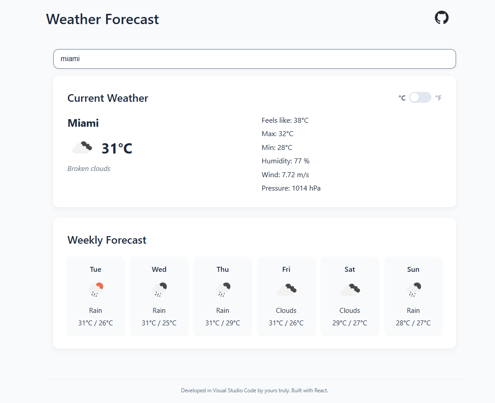

# **Weather Forecast**

Weather Forecast App is a **responsive and accessible** React application that allows users to **search for any city** and view **current weather conditions** along with a **7‑day forecast**. It follows best practices in frontend development, leveraging **Context API with reducer** for async state management, and **CSS Modules** for scoped, maintainable styling.

## **Description**

This project is part of my portfolio to **demonstrate clean, scalable frontend architecture** with no external UI libraries, focusing on **modularity, accessibility, and editorial clarity**.



### **Key Features**

- **City search** with debounced input to reduce unnecessary API calls.
- **Current weather details**: temperature, feels like, min/max, humidity, wind speed, and pressure.
- **7‑day forecast** with daily summaries and weather icons.
- **°C / °F toggle** with instant conversion and smooth UX.
- **Responsive design** for mobile, tablet, and desktop.
- **Accessible UI** with ARIA labels and keyboard navigation.
- **Modular and scalable architecture** for maintainability and onboarding clarity.

---

## **Technologies Used**

- **React** – Component-based UI development.
- **Context API + Reducer** – Global async state management without Redux.
- **Vite** – Fast build tool and development environment.
- **CSS Modules** – Scoped, maintainable, and accessible styling.
- **OpenWeather API** – Reliable weather data source.

---

## **Getting Started**

### **Installation & Setup**

Follow these steps to run the project locally:

1. Clone the repository:

   ```bash
   git clone https://github.com/maitepv87/weather-forecast.git
   cd weather-forecast

   ```

2. Install dependencie:

   ```bash
   npm install
   ```

3. Set up environment variables in a .env file:

   ```ini
   VITE_API_URL=https://api.openweathermap.org/data/2.5/
   VITE_API_KEY=your_openweather_api_key
   ```

4. Start the development server:

   ```bash
   npm run dev
   ```

Then open http://localhost:3000 in your browser.
